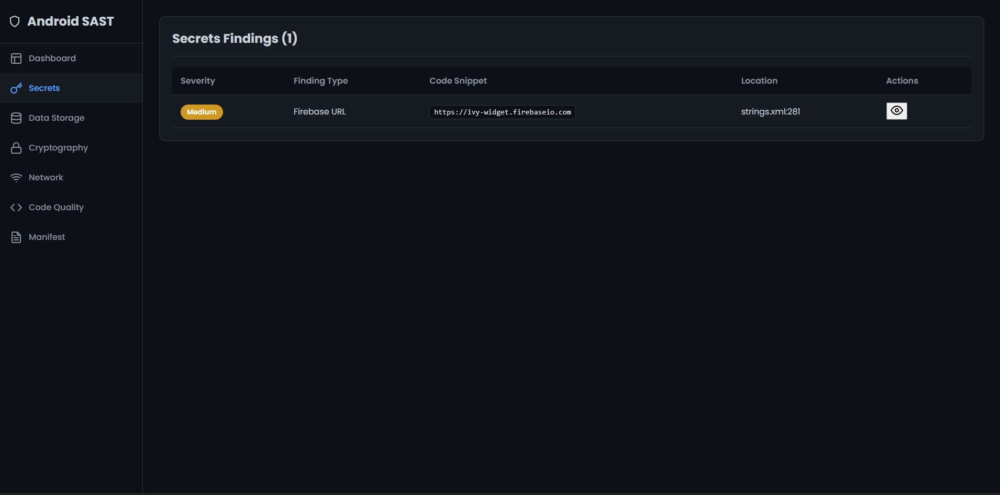
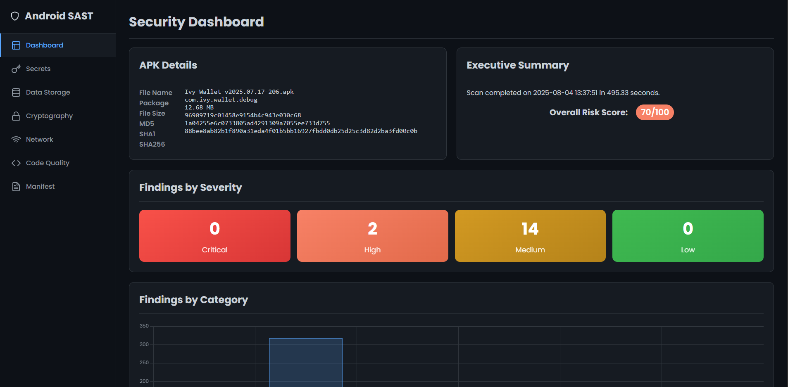
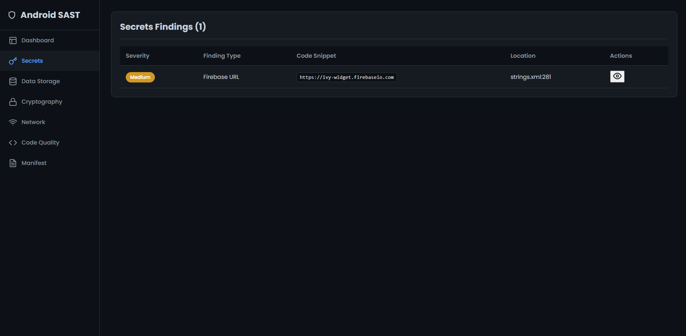
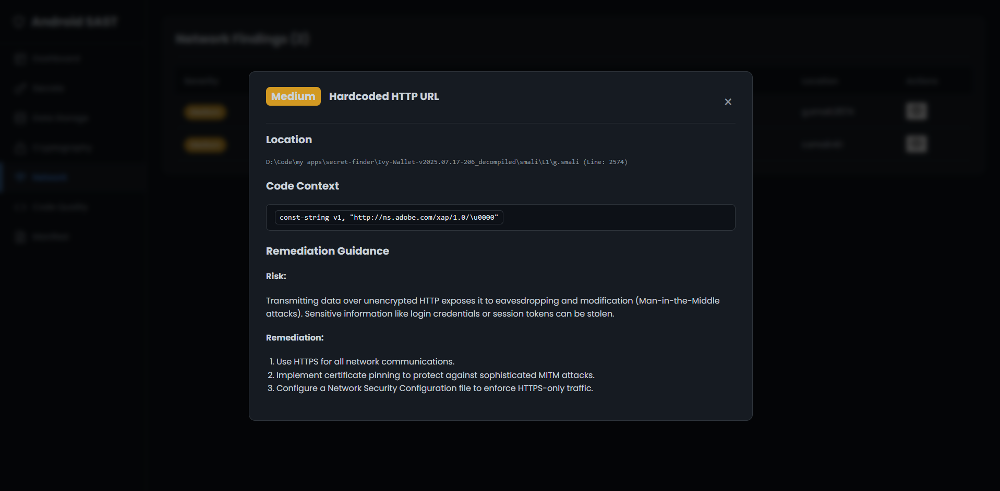
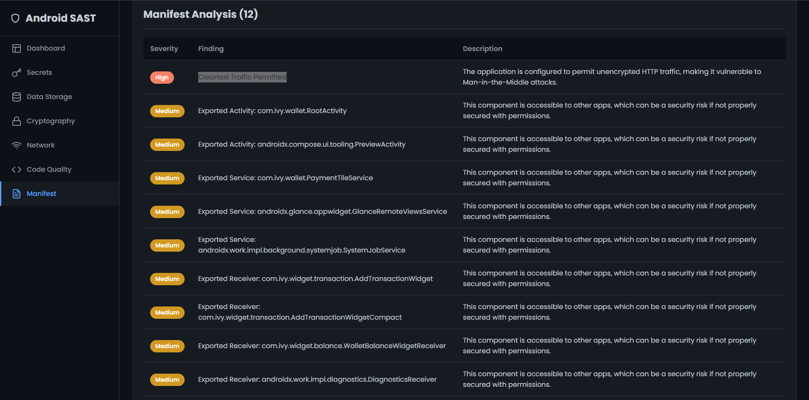
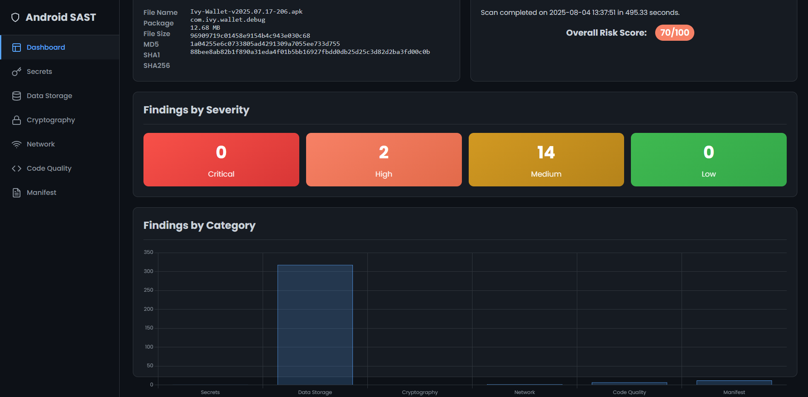

<div align="center">

# 🛡️ Secret Finder

### A high-performance static analysis tool to find secrets, API keys, and tokens in Android APKs.

[](https://github.com/viralvaghela)
[](https://opensource.org/licenses/MIT)
[](https://www.python.org/downloads/)
[](https://github.com/viralvaghela/secret-finder/pulls)

</div>

---


<summary><strong> Screenshots</strong></summary>
<br>
<table>
  <tr>
    <td align="center">Dashboard View</td>
    <td align="center">Findings Table</td>
    <td align="center">Code Context</td>
  </tr>
  <tr>
    <td></td>
    <td></td>
    <td></td>
  </tr>
    <tr>
    <td></td>
    <td></td>
    <td></td>
  </tr>
</table>


---

**Secret Finder** is a command-line tool designed to rapidly scan decompiled Android applications for hardcoded secrets. It moves beyond simple keyword searching by using a powerful regex engine to identify high-entropy strings, specific key patterns, and other sensitive data that could pose a security risk.

The output is a beautiful, self-contained HTML report that provides a clear, actionable overview of all findings, helping developers and security auditors quickly identify and remediate potential vulnerabilities.

## 🌟 Key Features

* **🎯 High-Precision Regex Engine:** Utilizes a comprehensive library of over 40 regex patterns to accurately detect private keys, API keys (AWS, Google, Stripe), OAuth tokens, database URIs, and much more.
* **⚡️ Blazing Fast Scans:** Leverages multiprocessing to scan files in parallel, drastically reducing analysis time on multi-core systems.
* **📊 Interactive Dashboard:** Generates a professional HTML report with interactive charts, a sortable findings table, and in-line code context previews.
* **🎚️ Severity Ranking:** Classifies findings as **Critical**, **High**, **Medium**, or **Low** to help you prioritize the most dangerous exposures first.
* **⚙️ Simple & Flexible:** Easy-to-use CLI with options for a quick basic scan or a comprehensive deep scan of all files.

## 🚀 Getting Started

### Prerequisites

* Python 3.8+

### Installation

1.  **Clone the repository:**
    ```bash
    git clone [https://github.com/viralvaghela/secret-finder.git](https://github.com/viralvaghela/secret-finder.git)
    cd secret-finder
    ```

2.  **Install dependencies:**
    ```bash
    pip install -r requirements.txt
    ```

3.  **Download `apktool.jar`:**
    *(Ensure `apktool.jar` is available in your PATH or the project directory).*

## 🛠️ Usage

Using the tool is straightforward. Point it at your target APK file and choose your scan level via the interactive prompt.

```sh
$ python secret_finder.py

Welcome to the Secret Finder!

Enter the path to the APK file: path/to/your/app.apk

Select file check option:
[1] Basic Scan (Fast - Checks AndroidManifest.xml and strings.xml)
[2] Advanced Scan (Slow - Checks all decompiled files)
Enter your choice (1 or 2): 2
```

* **Basic Scan:** A quick check of the most common locations for hardcoded secrets. Ideal for a fast, initial assessment.
* **Advanced Scan:** A comprehensive analysis that decompiles the entire APK and scans every single file. Recommended for deep security audits.

## 📄 Sample Report

After a scan is complete, a report file named `security_report_<apk_name>.html` will be generated in the root directory.

The interactive report allows you to:
* View a summary of findings with charts.
* See the distribution of secrets by severity and type.
* Sort, filter, and search through all findings.
* Click a finding to view the exact line of code where the secret was found.
* Copy the secret value or file path directly to your clipboard.

## 🤝 Contributing

Contributions are what make the open-source community such an amazing place to learn, inspire, and create. Any contributions you make are **greatly appreciated**.

1.  Fork the Project
2.  Create your Feature Branch (`git checkout -b feature/AmazingFeature`)
3.  Commit your Changes (`git commit -m 'Add some AmazingFeature'`)
4.  Push to the Branch (`git push origin feature/AmazingFeature`)
5.  Open a Pull Request

## 📜 License

This project is distributed under the MIT License. See `LICENSE` for more information.

## 🙏 Credits

This tool builds upon the foundational work and vision of **[viralvaghela](https://github.com/viralvaghela)**.
